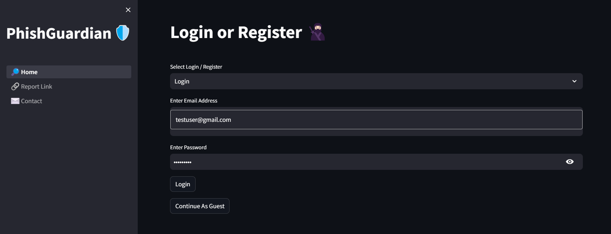
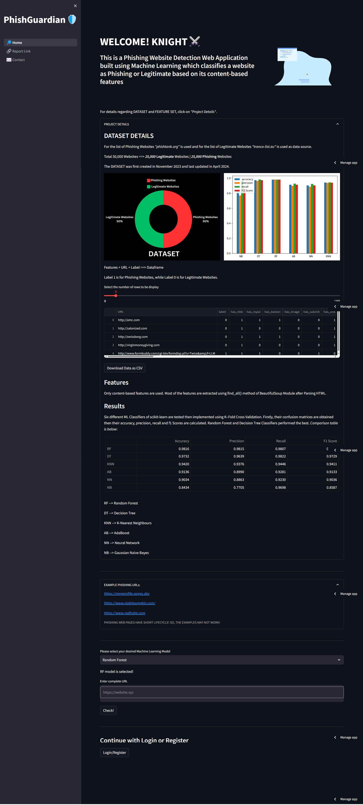

# 🛡️ PhishGuardian

**PhishGuardian** is a **Phishing Website Detection Web Application** that utilizes machine learning and content-based features to identify phishing sites. Built to enhance cybersecurity, it offers real-time phishing detection to protect users from potentially harmful websites. 🕵️‍♂️🔒

## 🛠️ Features

- **🔍 Phishing Detection**: Automatically detects phishing websites with a 98% F1-Score.
- **🌐 Web Interface**: User-friendly streamlit web app for easy access and interaction.
- **📊 Custom Dataset**: Contains a dataset of 50,000 websites with 43 features collected specifically for training the model.
- **⚙️ Trained Models**: Includes trained Random Forest and Decision Tree models for high accuracy.
- **💾 Real-Time Analysis**: Provides instant phishing verdict for websites.

## 🖥️ Tech Stack

PhishGuardian integrates several technologies to deliver a reliable and efficient user experience:

- **[Python](https://www.python.org/)**: Backend and machine learning model implementation.
- **[Scikit-learn](https://scikit-learn.org/)**: Machine learning library used to build and train the phishing detection models.
- **[Streamlit](https://streamlit.io/)**: Framework for building the web app interface, allowing real-time interaction with the model.
- **[Firebase](https://firebase.google.com/)**: Used for secure data storage.
- **[BeautifulSoup](https://www.crummy.com/software/BeautifulSoup/)**: Utilized for web scraping to gather data for the custom dataset.
- **[Pandas](https://pandas.pydata.org/)** and **[Numpy](https://numpy.org/)**: Libraries for data processing and manipulation.

## 📁 Directory Structure

```
phishguardian/
├── datasets/               # Dataset files for model training
├── images/                 # Image assets for the app
├── pages/                  # Pages for multi-page Streamlit app
├── style/                  # Styling and CSS for the app
├── trained_models/         # Trained models
├── 1_🔵_Home.py            # Main home page script for the app
├── data_collector.py       # Script for data collection and scraping
├── feature_extraction.py   # Code for extracting features from the data
├── features.py             # Features to be scraped
├── machine_learning.py     # Script for training and evaluating the models
├── ml_app_screen.py        # Code for rendering the ML application screen
├── requirements.txt        # List of dependencies
└── README.md               # Project README file
```

## 🚀 Getting Started

### Prerequisites

Ensure you have the following installed:

- Python 3.8 or higher
- Streamlit
- Other dependencies listed in `requirements.txt`

### Installation

1. **Clone the repository:**

   ```bash
   git clone https://github.com/your-username/phishguardian.git
   cd phishguardian
   ```

2. **Install dependencies:**

   ```bash
   pip install -r requirements.txt
   ```

3. **Run the app:**

   ```bash
   streamlit run 1_🔵_Home.py
   ```

### Usage

- Open the web application in your browser (usually at `http://localhost:8501`).
- Use the interface to upload website URLs and receive phishing detection results in real time.

## 🔍 Model Details

PhishGuardian uses machine learning models trained on a custom dataset of content-based features scrapped from 50,000 websites. The models are trained to accurately distinguish between phishing and legitimate websites with a F1-Score of 98%.

## 🖼️ Screenshots





## 🔗 Useful Links

- [Streamlit App](https://phishguardian.streamlit.app/)
- [Download Dataset](https://www.kaggle.com/datasets/caa4151f1b51bb917db7f8fa856f7ff60d6253a4989502dc5539c54f38a62ffe)
- [Streamlit Documentation](https://docs.streamlit.io/)
- [Firebase Documentation](https://firebase.google.com/docs)
- [Scikit-learn Documentation](https://scikit-learn.org/stable/)
- [BeautifulSoup Documentation](https://www.crummy.com/software/BeautifulSoup/bs4/doc/)
